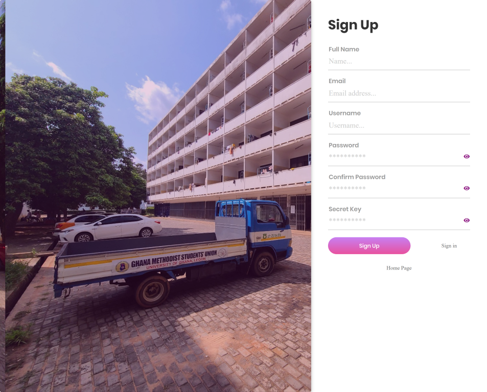
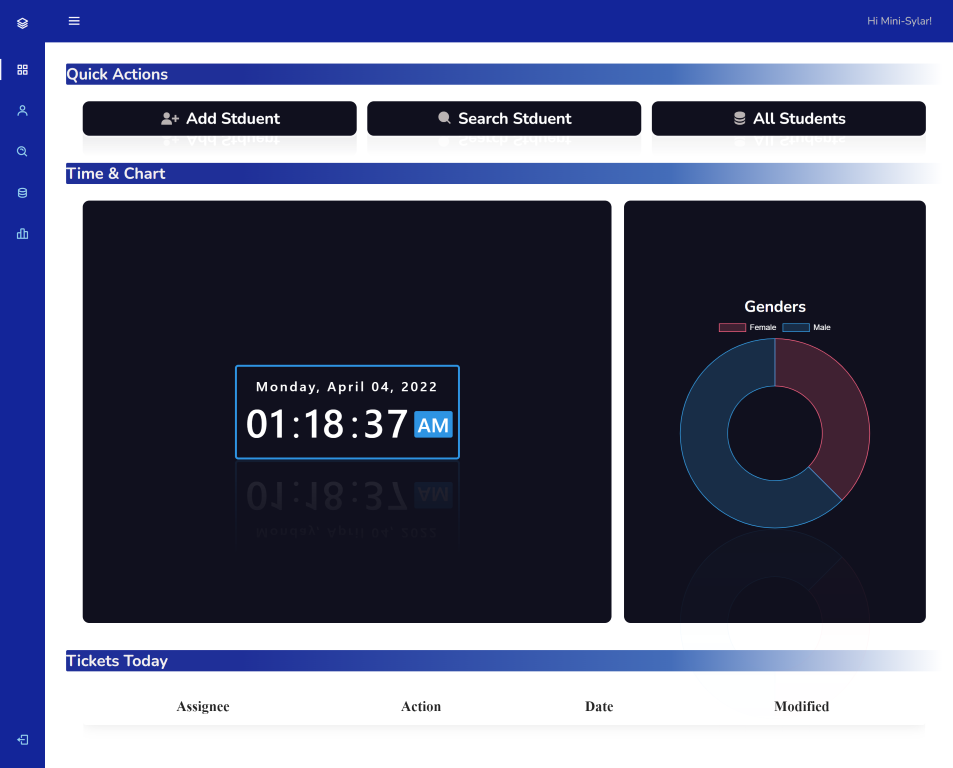
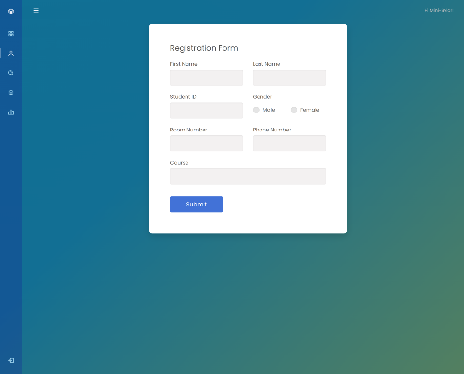
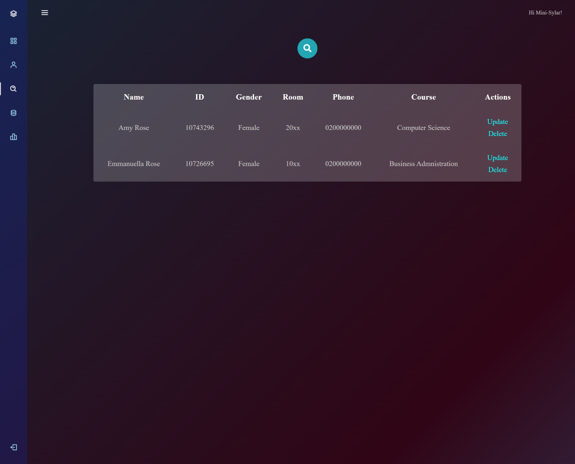
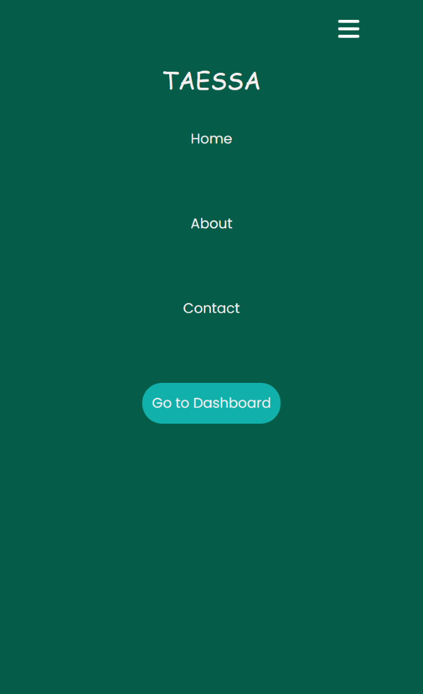
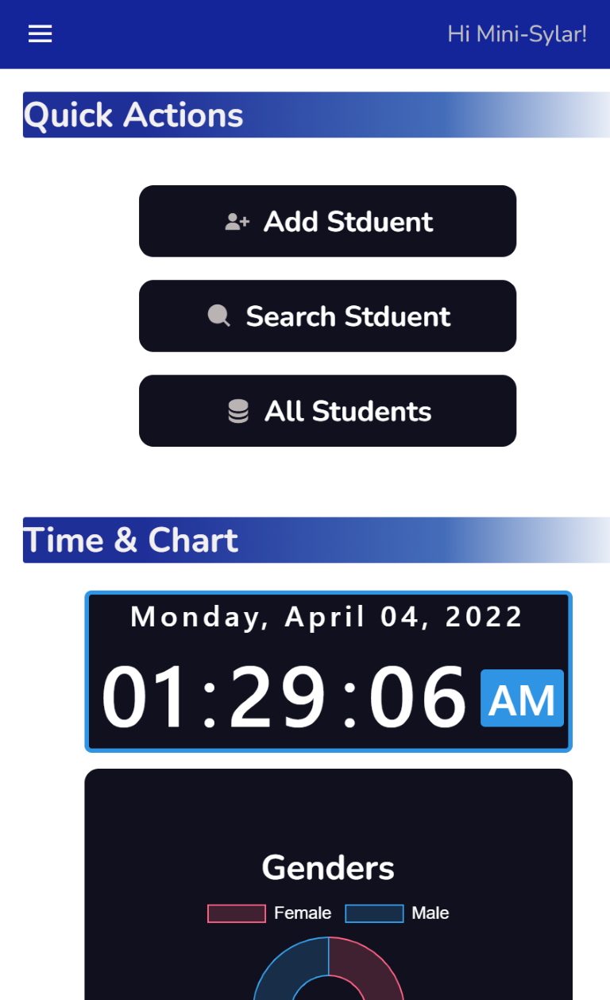
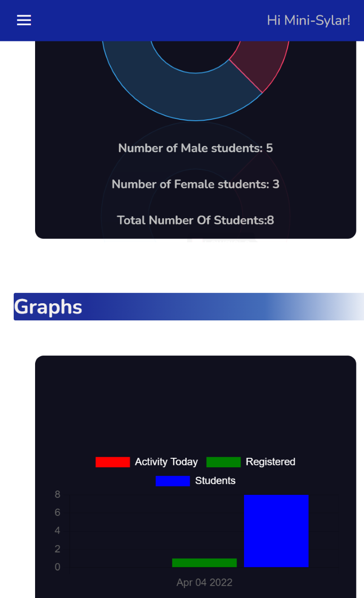

# Hall Management System
A public version of the hall management system

# Try it Out
- 👉 [Hall Management System](https://hall-management-public-dev.herokuapp.com/) 👈
- Secret key for account creation: "*porter2021*" Case Sesntive!!!

# Purpose
- Provide porters with an easier way to manage students entering and leaving the hall
- More information on the *about page*

# ---Features---
1. Creation of a unique Accounts
2. Dashboard for easy navigation
3. Add,delete,modify or remove students
4. Activity Log
5. Graphical Representation of Data
6. Reset Password Feature 
7. Stay Logged in

# Notes
* Sample data has been provided but you can go ahead and create,add,update or remove students
* Per Heroku's Terms of use on databases such as "SQLite", the following data will be deleted after 24 hours
   * Login Data
   * Data Added,Updated or Modified
   * Activity log
* This systen was designed with Laptop/Desktop users in mind first, however the mobile version is currently functional 😊

# Screenshots
## Desktop

## Mobile

# Technologies Used
- Python (Flask)
- HTML,CSS,Vanilla JS
- SQLlite
- Heroku
